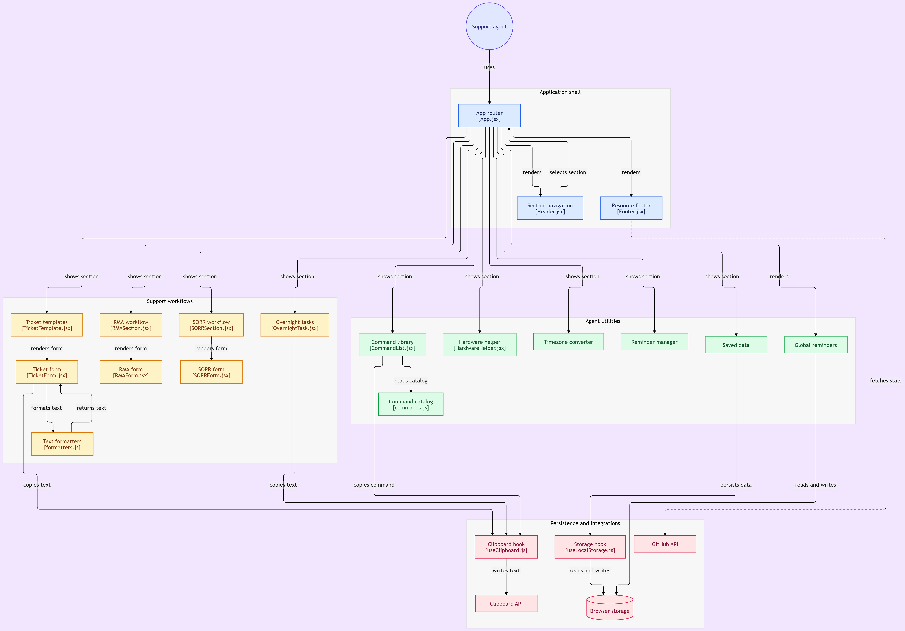

# NCR Voyix Agent Tool

Internal productivity tool for NCR Voyix support agents. A single-page React application that streamlines ticket submission, provides quick access to frequently used commands, documents hardware references, and persists agent data locally. Built with React 18 and Vite, deployed to GitHub Pages.

The tool replaces the legacy ticketing flow with a faster, keyboard-friendly interface: multiple tickets can be open in parallel tabs, command blocks are copy-to-clipboard, and hardware references are filterable by category.

---

## Architecture / Flow Diagram



---

## Tech Stack

| Layer | Technology |
|---|---|
| Framework | React 18.3 |
| Language | JavaScript (ES2020+, JSX) |
| Build Tool | Vite 5 |
| Animation | GSAP, `@gsap/react`, Framer Motion |
| Date Handling | `date-fns`, `date-fns-tz` |
| Icons | Lucide React |
| Decorative | `react-snowfall` |
| Persistence | Browser `localStorage` |
| Linting | ESLint 9 with `eslint-plugin-react`, `react-hooks`, `react-refresh` |
| Deployment | GitHub Pages via `gh-pages` |

---

## Features

- Multi-tab ticket workspace with independent state per ticket, tab switching, and tab close.
- Clipboard integration via `navigator.clipboard` with a top-anchored notification on success or failure.
- Commands section with per-command copy buttons and inline status feedback.
- Hardware reference section with category filters and a filterable image gallery.
- Save-data cards for storing and deleting agent-side snippets, persisted through `localStorage`.
- Scroll banner with continuous marquee at the top of the page.
- Timezone-aware date utilities through `date-fns-tz`.
- Custom favicon set (SVG, PNG, web manifest) for standalone install.
- Responsive layout that adapts to narrower agent workstations.
- No backend required; all state is client-side.

---

## Project Structure

```text
ncr-voyix-agent-tool/
├── public/
│   └── favicon/                          Favicon set and web manifest
├── src/
│   ├── components/
│   │   ├── common/
│   │   │   ├── CopyNotification.jsx      Top-anchored clipboard status toast
│   │   │   └── CopyNotification.css
│   │   ├── layout/
│   │   │   ├── ScrollBanner.jsx          Continuous marquee banner
│   │   │   └── ScrollBanner.css
│   │   └── sections/
│   │       ├── Commands/
│   │       │   └── CommandItem.jsx       Command row with copy action
│   │       ├── Hardware/
│   │       │   ├── HardwareGallery.jsx   Filterable hardware image gallery
│   │       │   ├── HardwareGallery.css
│   │       │   ├── HardwareHelper.css    Filters and layout for hardware section
│   │       ├── SaveData/
│   │       │   └── DataCard.jsx          Saved data card with delete action
│   │       └── TicketTemplate/
│   │           └── TicketTab.jsx         Single tab in the ticket workspace
│   ├── hooks/
│   │   ├── useClipboard.js               Clipboard write with notification state
│   │   └── useLocalStorage.js            Persisted state hook
│   ├── styles/
│   │   └── animations.css                Shared keyframe animations
│   ├── App.jsx                           Application root and layout composition
│   └── main.jsx                          Application bootstrap
├── eslint.config.js
├── index.html                            HTML shell with favicon and fonts
├── package.json
└── vite.config.js                        Vite config with base path and aliases
```

---

## Setup and Installation

### Prerequisites

- Node.js 20 or newer
- npm 10 or newer

### Install

```bash
git clone https://github.com/it-support-agent-tool/ncr-voyix-agent-tool.git
cd ncr-voyix-agent-tool
npm install
```

### Development server

```bash
npm run dev
```

Vite serves the application on `http://localhost:3000`.

### Production build

```bash
npm run build
```

Output is written to `dist/`.

### Preview production build

```bash
npm run preview
```

### Lint

```bash
npm run lint
```

### Deploy to GitHub Pages

```bash
npm run deploy
```

The `predeploy` script runs `npm run build` before publishing `dist/` through `gh-pages`.

---

## Path Aliases

Aliases are defined in `vite.config.js` and can be used across the codebase:

| Alias | Resolves To |
|---|---|
| `@` | `src` |
| `@components` | `src/components` |
| `@hooks` | `src/hooks` |
| `@utils` | `src/utils` |
| `@data` | `src/data` |
| `@styles` | `src/styles` |

---

## Deployment

The application is configured for GitHub Pages with a fixed base path:

```text
/ncr-voyix-agent-tool/
```

The expected deployment URL is:

```text
https://it-support-agent-tool.github.io/ncr-voyix-agent-tool/
```

The `base` value in `vite.config.js` is set to the repository path. If the tool is ever moved to a root-level custom domain, this value must be changed to `/`.

---

## Security & Architecture Considerations

- Fully client-side: no backend, no authentication layer, no server-side session storage.
- Data persisted in `localStorage` is scoped to the browser profile. Clearing site data removes it.
- The clipboard hook uses the asynchronous Clipboard API and handles failures with a visible error notification.
- No third-party tracking, analytics, or external API calls are made by the application.
- External links, when present, use `rel="noopener noreferrer"`.
- Google Fonts is loaded through a `<link>` element with `preconnect` to reduce latency.
- The tool is intended for use by authorized NCR Voyix support personnel on managed workstations.

---

## License

Proprietary and internal. Copyright (c) NCR Voyix Agent Tool contributors. All rights reserved. Redistribution or public commercial use without prior written permission is prohibited.
